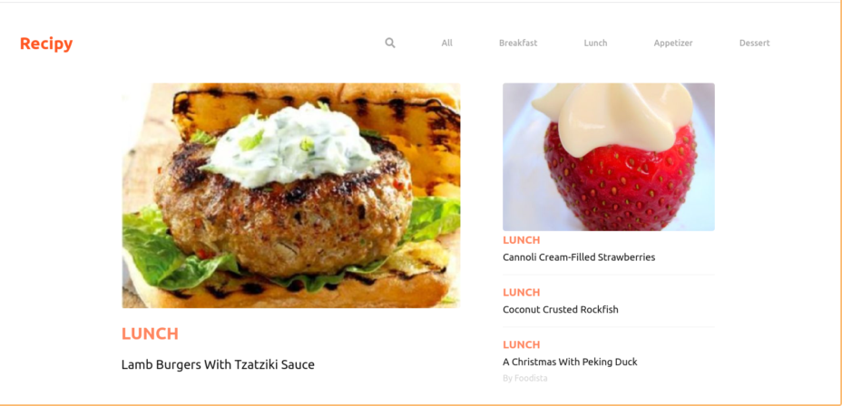
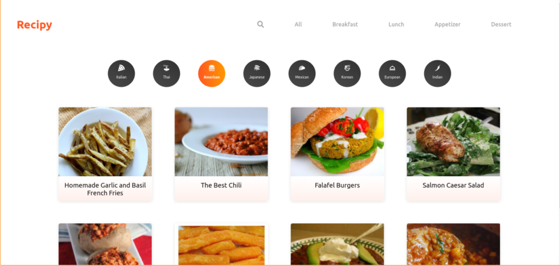
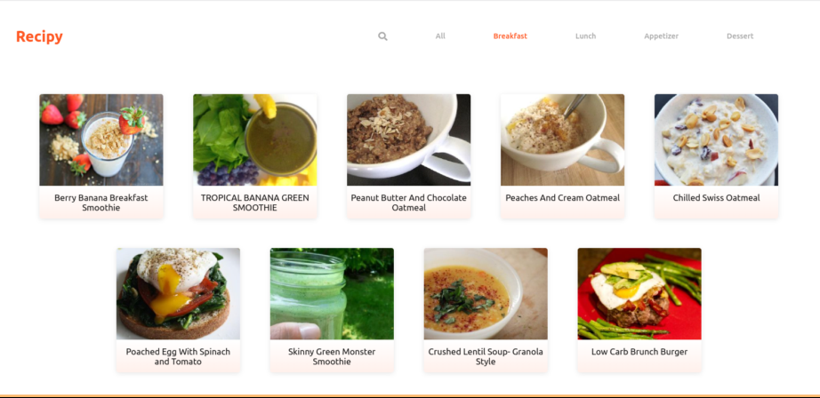
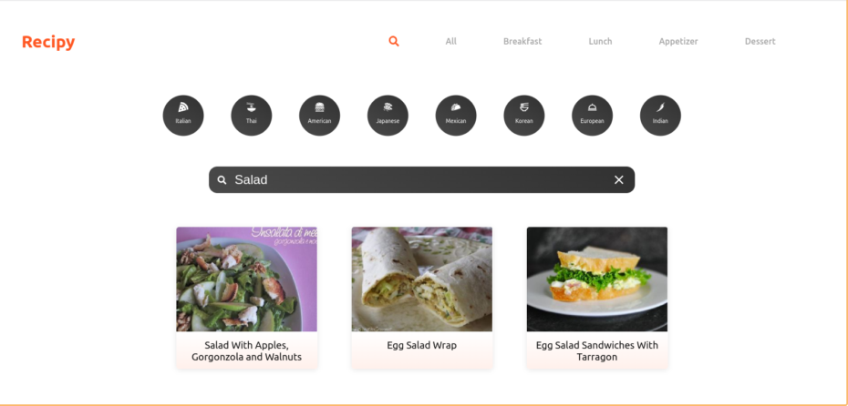
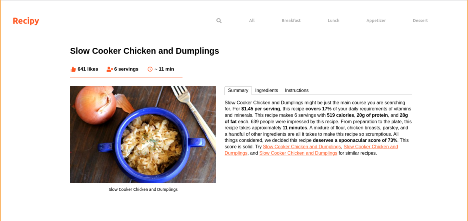

# Recipy App

### React Application using [Spoonacular API](https://spoonacular.com/). The project's main idea was to exercise my API skills and build my confidence with Axios, rendering data on the page, and stretching up my React and SASS skills. During my prebuilding research, I came across [Dev Ed](https://www.youtube.com/channel/UClb90NQQcskPUGDIXsQEz5Q) youtube video, and his last React Crash Course inspired me.   During the project, I faced several obstacles and resolved them, which made me feel more confident with APIs.

#### I appreciate your interest in my App. I should mention that the App has some limitations from its 'free-use' policy - 50 requests per day only :). I hope it will not change your first impression.

 

# Tech Stack

- React.js
- axios
- SASS

# Screenshots

## Home Page

## Cuisine Page

## Type of Dish Page

## Search Page

## Recipe Page

